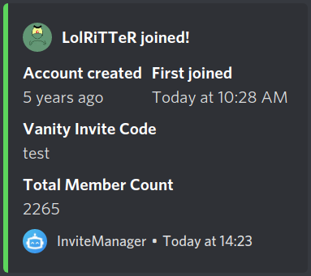
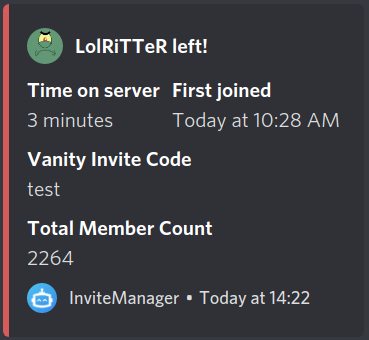

# Beispiele

## Normal

```text
!config joinMessage {memberMention} ist dem Server **beigetreten**; Eingeladen von **{inviterName}** (**{numInvites}** invites)
```

```text
!config leaveMessage {memberName} hat den Server nach {joinedAt:duration} **verlassen**; Eingeladen von **{inviterName}**
```

## Normal (Vanity)

```text
!config joinMessageVanity {memberMention} **joined** using the vanity invite code **{inviteCode}**
```

```text
!config leaveMessageVanity {memberName} **left** after {joinedAt:duration} on this server
```

## Embed

### Beitrittsnachricht

<!-- tabs:start -->

#### ** Screenshot **


#### ** Code **

```text
!config joinMessage { "color": "#5cd65c", "author": { "name": "{memberName} ist beigetreten!", "icon_url": "{memberImage}" }, "fields": [ { "name": "Account erstellt", "value": "{memberCreated:timeAgo}", "inline": true }, { "name": "Erster Beitritt", "value": "{firstJoin:date}", "inline": true }, { "name": "Anzahl an Beitritten", "value": "{numJoins}", "inline": true }, { "name": "Eingeladen von", "value": "{inviterMention}\n{numInvites} (regulär: {numRegularInvites}, bonus: {numBonusInvites}, gefälscht: {numFakeInvites}, verlassen: {numLeaveInvites})" }, { "name": "Einladungscode", "value": "{inviteCode} im Channel {channelMention}" }, { "name": "Anzahl an Mitgliedern", "value": "{memberCount}" } ] }
```

<!-- tabs:end -->

### Join Message (Vanity)

<!-- tabs:start -->

#### ** Screenshot **



#### ** Code **

```text
!config joinMessageVanity { "color": "#5cd65c", "author": { "name": "{memberName} joined!", "icon_url": "{memberImage}" }, "fields": [ { "name": "Account created", "value": "{memberCreated:timeAgo}", "inline": true }, { "name": "First joined", "value": "{firstJoin:date}", "inline": true }, { "name": "Vanity Invite Code", "value": "{inviteCode}" }, { "name": "Total Member Count", "value": "{memberCount}" } ] }
```

<!-- tabs:end -->

### Verlassensnachricht

<!-- tabs:start -->

#### ** Screenshot **


#### ** Code **

```text
!config leaveMessage { "color": "#d65c5c", "author": { "name": "{memberName} hat den Server verlassen!", "icon_url": "{memberImage}" }, "fields": [ { "name": "Verbrachte Zeit", "value": "{joinedAt:duration}", "inline": true }, { "name": "Erster Beitritt", "value": "{firstJoin:date}", "inline": true }, { "name": "Anzahl an Beitritten", "value": "{numJoins}", "inline": true }, { "name": "Eingeladen von", "value": "{inviterMention}\n{numInvites} (regulär: {numRegularInvites}, bonus: {numBonusInvites}, gefälscht: {numFakeInvites}, verlassen: {numLeaveInvites})" }, { "name": "Einladungscode", "value": "{inviteCode} im Channel {channelMention}" }, { "name": "Anzahl an Mitgliedern", "value": "{memberCount}" } ] }
```

<!-- tabs:end -->

### Leave Message (Vanity)

<!-- tabs:start -->

#### ** Screenshot **



#### ** Code **

```text
!config leaveMessageVanity { "color": "#d65c5c", "author": { "name": "{memberName} left!", "icon_url": "{memberImage}" }, "fields": [ { "name": "Time on server", "value": "{joinedAt:duration}", "inline": true }, { "name": "First joined", "value": "{firstJoin:date}", "inline": true }, { "name": "Vanity Invite Code", "value": "{inviteCode}" }, { "name": "Total Member Count", "value": "{memberCount}" } ] }
```

<!-- tabs:end -->
